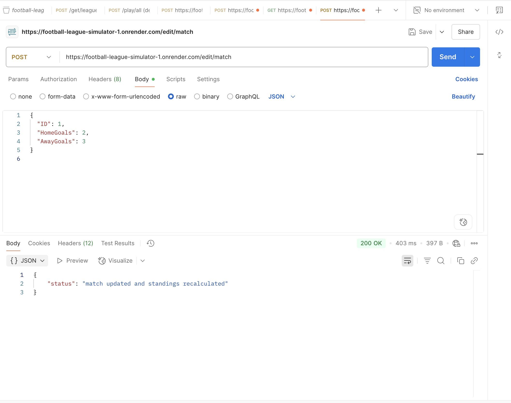

# Football League Simulator

A backend simulation of a football league implemented in Go (Golang), complete with REST API endpoints, match logic based on team strength, and editable match results. This project is built for testing and showcasing API design, basic simulations, and data management using SQLite.

---

## Project Structure

```text
.
├── main.go                         # Entry point of the application
├── api.go                          # REST API handlers and route definitions
├── db.go                           # Database connection and initialization logic
├── models/
│   └── models.go                   # GORM models for teams and matches
├── league/
│   ├── league.go                   # Core league logic (fixtures, simulation, table)
│   ├── team.go                     # Team struct and goal difference method
│   ├── match.go                    # Match struct
│   └── simulator.go                # Match simulation logic based on team strength
├── static/
│   └── index.html                  # Minimal frontend to interact with the API
├── postman/
│   └── football-league-api.postman_collection.json  # Postman collection for testing
└── go.mod / go.sum                # Go module dependencies
```

## 🚀 Running the Project Locally

### 🛠 Prerequisites
- Go 1.18 or newer
- Git
- Postman (for API testing, optional)
- SQLite (optional, for viewing DB manually)

### 📦 Installation & Running

1. Clone the repository

```bash
git clone https://github.com/AlperErd0gan/football-league-simulator.git
cd football-league-simulator
```

2. Run the application

```bash
go run .
```

3. Visit the interface 

- http://localhost:8080

## 🧪 API Testing with Postman

### 📁 Postman Collection
A ready-to-use Postman collection is provided:

1. Open Postman

2. Click Import

3. Choose the file found in postman folder in the Github directory

4. Import local json for local testing or deployed URL 

## 🌍 Live Demo

🔗 [football-league-simulator-1.onrender.com](https://football-league-simulator-1.onrender.com)

You can test the app live using the built-in frontend or connect to the API directly.

### 🔌 Included Endpoints

| Endpoint           | Method | Description                                          |
|--------------------|--------|------------------------------------------------------|
| `/league`          | GET    | Returns current league table and last match results |
| `/play/week`       | POST   | Simulates the next week's matches                   |
| `/play/all`        | POST   | Simulates all remaining matches in the season       |
| `/restart`         | POST   | Resets league state and clears match history        |
| `/results/all`     | GET    | Fetches all match results grouped by week           |
| `/edit/match`      | POST   | Edits a match score by ID and recalculates standings |

#### 🧾 Example `POST /edit/match` Body

```json
{
  "ID": 3,
  "HomeGoals": 2,
  "AwayGoals": 1
}
```



## How It Works
- Teams are initialized with names and strength levels.

- Fixtures are generated using a double round-robin algorithm.

- Match results are simulated using Poisson-based logic scaled by team strength.

- Data is stored using SQLite and managed via GORM.

- Stats like Wins, Draws, Losses, Games Played, Goal Difference, and Points are updated live.

- League state is retained in memory and synced with the database after simulations or edits.

## Features
- Match simulation with randomness and team strength

- Dynamic league table with full stats

- Editable match results via API

- SQLite integration (no external DB needed)

- Minimal frontend to view results

- Postman collection included


## 🙋‍♂️ Author
Alper Erdoğan
GitHub


